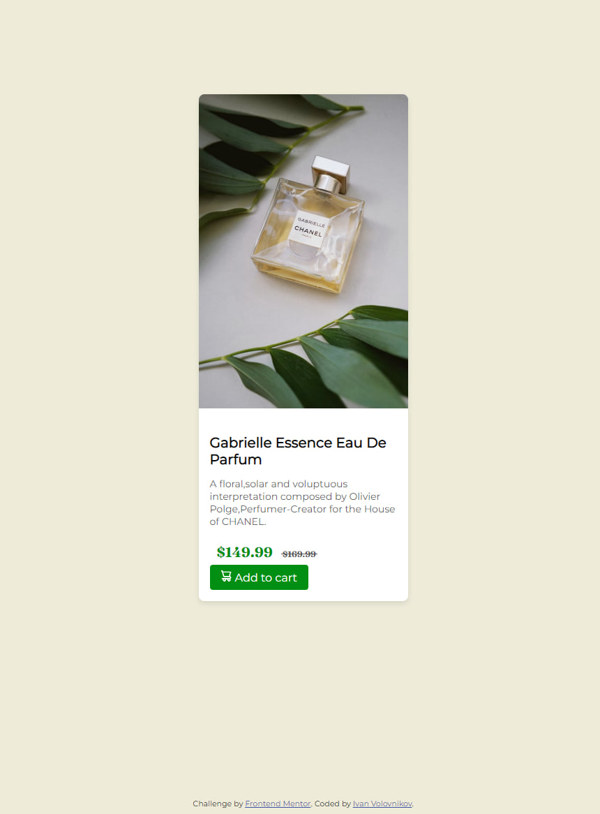

"Product Preview Card Component" - это компонент веб-интерфейса, который представляет собой стилизованную карточку, используемую для предварительного просмотра информации о продукте или услуге. Он обычно используется на веб-сайтах или веб-приложениях для отображения ключевых деталей о продукте, таких как название, изображение, описание и цена.

Этот компонент является важным элементом пользовательского интерфейса, который помогает привлечь внимание пользователей к конкретному продукту и предоставляет им основные сведения о нем. Карточка предварительного просмотра продукта обычно имеет привлекательный и понятный дизайн, который помогает улучшить визуальный опыт пользователей.

